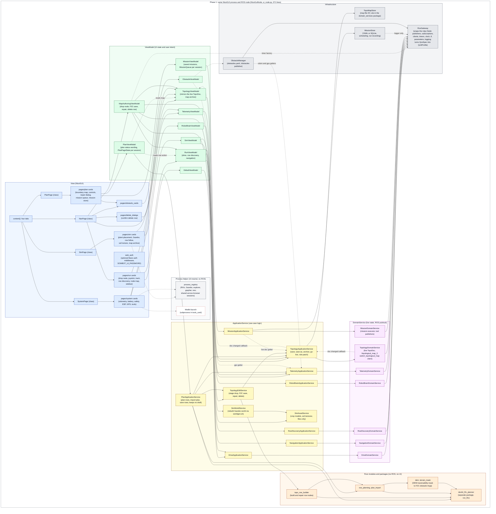

```mermaid
flowchart TB
  subgraph P1["Phase 1: same NiceGUI process and ROS node (NiceGuiNode, ui_node.py, 371 lines)"]
    subgraph UI["View (NiceGUI)"]
      Content["content(): four tabs"]
      NavPage["NavPage (class)"]
      PlanPage["PlanPage (class)"]
      SimPage["SimPage (class)"]
      SystemPage["SystemPage (class)"]
      RunCards["pages/run cards<br/>(drop node, joystick, track,<br/>row discovery, node map, sidebar)"]
      PlanCards["pages/plan cards<br/>(boundary map, controls, repair dialog,<br/>mission queue, mission store)"]
      SimCards["pages/sim cards<br/>(plant placement, Gazebo, row follow,<br/>soil texture, map archive)"]
      SysCards["pages/system cards<br/>(odometry, battery, safety, ESP, GPS, tools)"]
      ObsCards["pages/obstacle_cards"]
      DeleteDlg["pages/delete_dialogs<br/>(confirm delete row)"]
      WebAuth["web_auth<br/>(optional Basic auth middleware,<br/>SOWBOT_UI_PASSWORD)"]
    end

    subgraph PROC["Process helper (UI-neutral, no ROS)"]
      ProcReg["process_registry<br/>(RViz, Gazebo, explorer, grapher, neo;<br/>shared across browser sessions)"]
      Medkit["Medkit launch<br/>(subprocess in tools_card)"]
    end

    subgraph VM["ViewModel (UI state and user intent)"]
      GlobalVM["GlobalViewModel"]
      RunVM["RunViewModel<br/>(drive, row discovery, navigation)"]
      AuthoringVM["MapAuthoringViewModel<br/>(drop node, F2C save, repair, delete row)"]
      TopoVM["TopologyViewModel<br/>(mirrors the live TopoDoc, map archive)"]
      TelemetryVM["TelemetryViewModel"]
      RobotBrainVM["RobotBrainViewModel"]
      PlanVM["PlanViewModel<br/>(plan status wording, PlanPageState per session)"]
      MissionVM["MissionViewModel<br/>(saved missions, MissionQueue per session)"]
      ObstacleVM["ObstacleViewModel"]
      SimVM["SimViewModel"]
    end

    subgraph APPSVC["ApplicationService (use-case logic)"]
      DriveApp["DriveApplicationService"]
      NavApp["NavigationApplicationService"]
      RowDiscApp["RowDiscoveryApplicationService"]
      RobotBrainApp["RobotBrainApplicationService"]
      TelemetryApp["TelemetryApplicationService"]
      TopologyApp["TopologyApplicationService<br/>(save, save-as, archive, go-live, role patch)"]
      TopologyEdit["TopologyEditService<br/>(stage drop, F2C save, repair, delete)"]
      PlanApp["PlanApplicationService<br/>(plan rows, import plan, save rows; keeps no draft)"]
      MissionApp["MissionApplicationService"]
      SimAssets["SimAssetService<br/>(crop models, soil textures; files only)"]
      SimWorld["SimWorldService<br/>(rebuild Gazebo world via worldgen.sh)"]
    end

    subgraph DOMSVC["DomainService (live state, ROS pub/sub)"]
      DriveDom["DriveDomainService"]
      NavDom["NavigationDomainService"]
      RowDiscDom["RowDiscoveryDomainService"]
      RobotBrainDom["RobotBrainDomainService"]
      TelemetryDom["TelemetryDomainService"]
      TopologyDom["TopologyDomainService<br/>(live TopoDoc, /topological_map_2,<br/>switch_topological_map client)"]
      MissionDom["MissionDomainService<br/>(mission executor, tool publishers)"]
    end

    subgraph PURE["Pure modules and packages (no ROS, no UI)"]
      RowBuilder["topo_row_builder<br/>(build and repair row nodes)"]
      RowPlanning["row_planning, plan_import"]
      DemMod["dem, terrain_mask<br/>(DEM traversability mask to F2C obstacle rings)"]
      F2CPkg["devkit_f2c_planner<br/>(separate package, run_f2c)"]
    end

    subgraph INFRA["Infrastructure"]
      TopoMapStore["TopoMapStore<br/>(map file I/O; sits in the domain_services package)"]
      MissionStore["MissionStore<br/>(YAML or SQLite, scheduling, run recording)"]
      ObstacleManager["ObstacleManager<br/>(obstacles.yaml, /obstacles publisher)"]
      RosGateway["RosGateway<br/>(wraps the rclpy Node: publishers, subscriptions,<br/>clients, timers, clock, tf, parameters, logging;<br/>turns QosSpec into QoSProfile)"]
    end
  end

  Content --> NavPage
  Content --> PlanPage
  Content --> SimPage
  Content --> SystemPage
  NavPage --> RunCards
  NavPage --> ObsCards
  NavPage --> DeleteDlg
  PlanPage --> PlanCards
  PlanCards --> ObsCards
  SimPage --> SimCards
  SystemPage --> SysCards

  RunCards --> RunVM
  RunCards --> GlobalVM
  RunCards --> TopoVM
  NavPage --> TelemetryVM
  NavPage --> AuthoringVM
  PlanCards --> PlanVM
  PlanCards --> MissionVM
  PlanVM -.->|"reads map"| TopoVM
  PlanVM -.->|"reads row action"| RunVM
  SimCards --> SimVM
  SimCards --> TopoVM
  SysCards --> TelemetryVM
  SysCards --> RobotBrainVM
  ObsCards --> ObstacleVM
  DeleteDlg --> TopoVM

  SimCards -.-> ProcReg
  SysCards -.-> ProcReg
  SysCards -.-> Medkit

  AuthoringVM --> TopologyEdit
  AuthoringVM --> TopologyApp
  AuthoringVM --> TelemetryApp
  AuthoringVM --> TopoVM
  AuthoringVM --> RunVM

  GlobalVM --> DriveApp
  RunVM --> DriveApp
  RunVM --> RowDiscApp
  RunVM --> NavApp
  TopoVM --> TopologyApp
  TelemetryVM --> TelemetryApp
  RobotBrainVM --> RobotBrainApp
  PlanVM --> PlanApp
  MissionVM --> MissionApp
  SimVM --> SimAssets
  SimVM --> SimWorld
  ObstacleVM -.-> ObstacleManager

  PlanApp --> TopologyEdit
  PlanApp --> TopologyApp
  PlanApp --> TelemetryApp
  PlanApp --> RowPlanning
  PlanApp --> F2CPkg
  TopologyEdit --> TopologyApp
  TopologyEdit --> RowBuilder
  RowBuilder --> RowPlanning
  RowBuilder --> F2CPkg
  RowPlanning --> DemMod
  RowPlanning --> F2CPkg
  DemMod --> F2CPkg
  SimWorld --> SimAssets
  MissionApp -.->|"live doc getter"| TopologyApp
  ObstacleVM -.->|"gps getter"| TelemetryApp
  ObstacleManager -.->|"odom and gps getters"| TelemetryApp
  AuthoringVM -.->|"timer factory"| RosGateway

  DriveApp --> DriveDom
  NavApp --> NavDom
  RowDiscApp --> RowDiscDom
  RobotBrainApp --> RobotBrainDom
  TelemetryApp --> TelemetryDom
  TopologyApp --> TopologyDom
  TopologyApp --> TopoMapStore
  MissionApp --> MissionDom
  MissionApp --> MissionStore
  TopologyDom -.->|"doc changed callback"| TopologyApp
  TopologyApp -.->|"doc changed callback"| TopoVM

  DriveDom --> RosGateway
  NavDom --> RosGateway
  RowDiscDom --> RosGateway
  RobotBrainDom --> RosGateway
  TelemetryDom --> RosGateway
  TopologyDom --> RosGateway
  MissionDom --> RosGateway
  MissionStore -.->|"logger only"| RosGateway
  ObstacleManager --> RosGateway

  classDef view fill:#dbeafe,stroke:#1e40af,color:#111827,stroke-width:1px
  classDef todo fill:#ffffff,stroke:#b91c1c,color:#111827,stroke-width:1px,stroke-dasharray:4 3
  classDef vm fill:#dcfce7,stroke:#166534,color:#111827,stroke-width:1px
  classDef app fill:#fef9c3,stroke:#854d0e,color:#111827,stroke-width:1px
  classDef dom fill:#fae8ff,stroke:#86198f,color:#111827,stroke-width:1px
  classDef pure fill:#ffedd5,stroke:#9a3412,color:#111827,stroke-width:1px
  classDef infra fill:#e5e7eb,stroke:#374151,color:#111827,stroke-width:1px
  classDef proc fill:#f3f4f6,stroke:#374151,color:#111827,stroke-width:1px

  class Content,NavPage,PlanPage,SimPage,SystemPage,RunCards,PlanCards,SimCards,SysCards,ObsCards,DeleteDlg,WebAuth view
  class Medkit todo
  class ProcReg proc
  class GlobalVM,RunVM,AuthoringVM,TopoVM,TelemetryVM,RobotBrainVM,PlanVM,MissionVM,ObstacleVM,SimVM vm
  class DriveApp,NavApp,RowDiscApp,RobotBrainApp,TelemetryApp,TopologyApp,TopologyEdit,PlanApp,MissionApp,SimAssets,SimWorld app
  class DriveDom,NavDom,RowDiscDom,RobotBrainDom,TelemetryDom,TopologyDom,MissionDom dom
  class RowBuilder,RowPlanning,DemMod,F2CPkg pure
  class TopoMapStore,MissionStore,ObstacleManager,RosGateway infra

  style P1 fill:#ffffff,stroke:#6b7280,color:#111827
  style UI fill:#eff6ff,stroke:#1e40af,color:#111827
  style PROC fill:#f9fafb,stroke:#374151,color:#111827
  style VM fill:#f0fdf4,stroke:#166534,color:#111827
  style APPSVC fill:#fefce8,stroke:#854d0e,color:#111827
  style DOMSVC fill:#fdf4ff,stroke:#86198f,color:#111827
  style PURE fill:#fff7ed,stroke:#9a3412,color:#111827
  style INFRA fill:#f3f4f6,stroke:#374151,color:#111827
```

